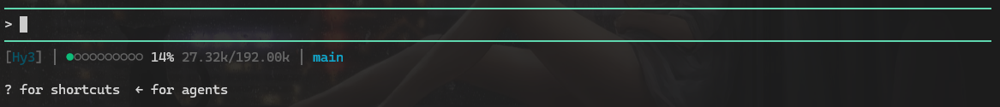

# Code Buddy Status Line

自定义 Code Buddy 状态栏脚本，从 stdin 读取 JSON，输出一行状态信息。

## 效果

```plaintext
[Hy3] │ ●○○○○○○○○○ 14% 27.32k/192.00k │ main
```



|    字段    |    说明    |
| :--------: | :--------: |
| 模型 | 模型名 |
| 上下文用量 | 进度条 + 百分比 + `已用/窗口大小` |
| Git 分支 | 青色：工作区干净<br>黄色：有未提交改动 |

**进度条颜色说明**

- 🟢 绿色：用量 < 50%
- 🟡 黄色：50% ~ 80%
- 🔴 红色：> 80%

## 安装

> 仅需 Python 标准库，无第三方依赖。

**快捷安装**

直接运行脚本进行配置：
~~~python
python3 install.py
~~~

**手动安装**

配置 `~/.codebuddy/settings.json`，加入以下内容：

```json
{
  "statusLine": {
    "type": "command",
    "command": "python3 /path/to/statusline-codebuddy/statusline.py",
    "padding": 0
  }
}
```
